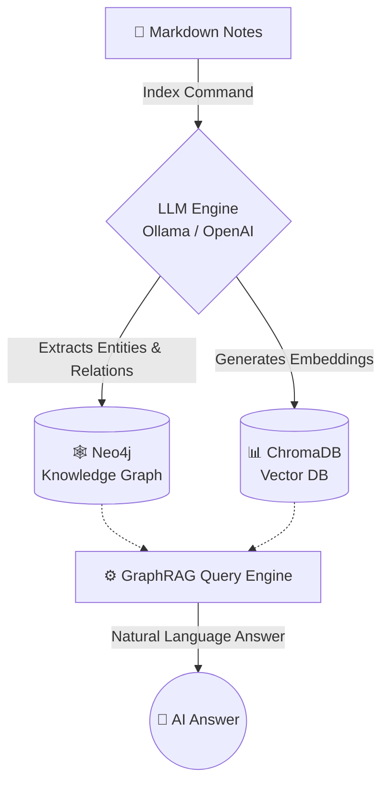

<p align="center">
  <h1 align="center">🧠 Synapse</h1>
  <p align="center">
    Transform your Markdown notes into an intelligent knowledge base<br/>
    using <strong>Vector Search</strong> and <strong>Knowledge Graphs</strong>.
  </p>
  <p align="center">
    <a href="https://github.com/Foton13/Synapse/actions/workflows/ci.yml"></a>
    <a href="#-quick-start"></a>
    <a href="LICENSE"></a>
    <a href="#-tech-stack"></a>
    <a href="#-tech-stack"></a>
  </p>
</p>

---

**🇬🇧 English** ∙ [🇺🇦 Українська](#-українська)

---

## 🌟 Why Synapse? (The GraphRAG Advantage)

Standard RAG (Retrieval-Augmented Generation) relies purely on **semantic similarity** (Vector DBs). If you ask *"How does module A affect module C?"*, standard RAG might fail if A and C are never mentioned in the same paragraph. 

**Synapse implements GraphRAG.** By combining **ChromaDB** (for text semantics) and **Neo4j** (for logical relationships), Synapse can traverse multi-hop connections across thousands of markdown files to answer complex, structural questions about your knowledge base. 

- 🔒 **Privacy First:** 100% local operation supported via Ollama.
- ⚡ **Fail-Fast & Typed:** Built with robust Pydantic validations and strict typing.
- 🐳 **Dockerized DBs:** Isolated environment for data storage.

## ✨ Features

- **LLM-Powered Extraction** — Automatically discovers entities and relationships in your notes using Ollama or OpenAI.
- **Knowledge Graph** — Stores structured knowledge in Neo4j as nodes and edges.
- **Semantic Search** — Finds similar ideas across notes via ChromaDB vector embeddings.
- **Hybrid GraphRAG** — Answers questions using both semantic similarity and graph relationships for richer context.
- **Pluggable LLMs** — Switch between local Ollama models and OpenAI with a single env var.

## 🏗 Architecture



## 📁 Project Structure

```text
synapse/
├── src/
│   ├── __init__.py
│   ├── main.py           # CLI entry point (Typer)
│   ├── processor.py      # LLM-based entity & relation extraction
│   ├── graph_store.py    # Neo4j wrapper
│   └── vector_store.py   # ChromaDB wrapper
├── tests/
│   ├── conftest.py       # Shared pytest fixtures
│   ├── test_processor.py # Model & factory tests
│   ├── test_integration.py # Docker-based E2E tests
│   └── test_vector_store.py
├── data/
│   └── example/          # Sample Markdown notes
├── .env.example          # Environment template
├── docker-compose.yml    # Neo4j container
├── pyproject.toml        # Modern Python package config
└── LICENSE
```

## 🛠 Tech Stack

| Component | Technology | Purpose |
|-----------|-----------|---------|
| **Orchestration** | LangChain | LLM pipeline & prompt management |
| **Graph DB** | Neo4j 5 | Knowledge graph storage |
| **Vector DB** | ChromaDB | Semantic embeddings & search |
| **LLM** | Ollama / OpenAI | Entity extraction & Q&A |
| **CLI** | Typer | Command-line interface |
| **Validation** | Pydantic v2 | Structured LLM output parsing |

## 🚀 Quick Start

### Prerequisites

- **Python 3.11+**
- **Docker** (for Neo4j)
- **Ollama** installed locally ([ollama.com](https://ollama.com)) — or an OpenAI API key

### 1 · Clone & Install

```bash
git clone git@github.com:Foton13/Synapse.git
cd Synapse

python -m venv .venv

# Linux / macOS
source .venv/bin/activate

# Windows
.venv\Scripts\activate

pip install -e .[dev]
```

### 2 · Start Neo4j

```bash
docker compose up -d
```

The Neo4j browser is available at [http://localhost:7474](http://localhost:7474).

### 3 · Configure

```bash
cp .env.example .env
# Edit .env — set your LLM provider and Neo4j password
```

### 4 · Pull an Ollama model (if using Ollama)

```bash
ollama pull llama3
```

## 📖 Usage

### Index your notes

Scan a directory of Markdown files and populate the knowledge base:

```bash
python -m src.main index ./data/example
```

```text
📂 Found 3 Markdown file(s)

  Processing project_helios.md …
    ✅ 8 entities, 6 relations
  Processing meeting_2026_03_15.md …
    ✅ 5 entities, 4 relations
  Processing vector_db_research.md …
    ✅ 6 entities, 5 relations

✨ Done — 3/3 files indexed successfully.
```

### Query entity connections

Look up an entity in the knowledge graph:

```bash
python -m src.main query "ClickHouse"
```

```text
🔗 Connections for 'ClickHouse':

  • ClickHouse  ─[RELATED]→  Project Helios
  • ClickHouse  ─[RELATED]→  PostgreSQL
```

### Ask a question (GraphRAG)

Ask a natural-language question answered using both vector and graph context:

```bash
python -m src.main ask "What databases are used in Project Helios?"
```

```text
🤖 AI: Project Helios uses ClickHouse as its analytical data warehouse
and PostgreSQL as the operational database. The team is currently
migrating analytics workloads from PostgreSQL to ClickHouse …
```

### Verbose mode

Add `-v` to any command for debug-level logging:

```bash
python -m src.main index ./data/example -v
```

## ⚙️ Configuration Reference

| Variable | Default | Description |
|----------|---------|-------------|
| `LLM_PROVIDER` | `ollama` | LLM backend: `ollama` or `openai` |
| `OLLAMA_MODEL` | `llama3` | Model name for Ollama |
| `OPENAI_API_KEY` | — | API key (required when `LLM_PROVIDER=openai`) |
| `NEO4J_URI` | `bolt://localhost:7687` | Neo4j Bolt connection URI |
| `NEO4J_USER` | `neo4j` | Neo4j username |
| `NEO4J_PASSWORD` | `password` | Neo4j password |
| `CHROMA_DB_PATH` | `./data/chromadb` | ChromaDB persistent storage path |

## 🧪 Testing

The project uses `pytest` and `testcontainers` for isolated integration testing. Docker must be running to execute the full suite.

```bash
pytest -v
```

## 📄 License

[MIT](LICENSE) © [Foton13](https://github.com/Foton13)

---

## 🇺🇦 Українська

### Чому Synapse? (Перевага GraphRAG)

Стандартний RAG (генерація з доповненим пошуком) покладається суто на **семантичну схожість** (векторні бази). Якщо спитати *"Як модуль А впливає на модуль В?"*, стандартний RAG може не знайти відповіді, якщо вони не згадані в одному абзаці.
Synapse використовує **GraphRAG**: він комбінує векторний пошук (ChromaDB) для розуміння тексту та графи (Neo4j) для логічних зв'язків. Це дозволяє AI відстежувати багатоланкові зв'язки між десятками нотаток.

### Що це?

**Synapse** — інструмент, який перетворює ваші Markdown-нотатки на інтелектуальну базу знань, поєднуючи **векторний пошук** (ChromaDB) та **графові зв'язки** (Neo4j) з потужністю великих мовних моделей (LLM).

### Можливості

- **Автоматичне вилучення** сутностей та зв'язків з тексту за допомогою LLM.
- **Граф знань** — структура знань зберігається в Neo4j.
- **Семантичний пошук** — швидкий пошук схожих ідей через ChromaDB.
- **Гібридний GraphRAG** — відповіді AI базуються як на семантиці, так і на структурі графа.
- **Локальна робота** — підтримка Ollama для повної конфіденційності ваших даних.

### Швидкий старт

```bash
# 1. Клонування та встановлення
git clone git@github.com:Foton13/Synapse.git
cd Synapse
python -m venv .venv
.venv\Scripts\activate          # Windows
# source .venv/bin/activate     # Linux / macOS
pip install -e .[dev]

# 2. Запуск Neo4j
docker compose up -d

# 3. Конфігурація
cp .env.example .env
# Відредагуйте .env — вкажіть LLM-провайдер та пароль Neo4j

# 4. Завантаження моделі Ollama (якщо використовуєте Ollama)
ollama pull llama3
```

### Використання

```bash
# Індексація нотаток
python -m src.main index ./data/example

# Пошук зв'язків сутності
python -m src.main query "ClickHouse"

# Запитання до бази знань
python -m src.main ask "Які бази даних використовуються в Project Helios?"
```

### Ліцензія

[MIT](LICENSE) © [Foton13](https://github.com/Foton13)
